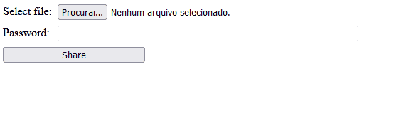

# File sharing password - site

Site where you can share archieves with or without password protection.
Using Javascript, Express, Mongoose, Multer, Ejs, Bcrypt and Dotenv

    

## Main Features

 - Password protection is optional
 - Password verification function
 - Uses encryption to protect from archieves with same name
 - Uses database to organize archieves

## Installation

  1.  git clone https://github.com/FernandoSaru/finance-app-react.git

  2.  cd finance-app-react 

  3.  npm install

  4. follow installation from Mongodb guide https://www.mongodb.com/docs/manual/administration/install-community/

  5. npm install mongoose

  6. npm install bcrypt

  7. npm install --save multer

  8. npm install dotenv --save

  9. npm install ejs

    
## How to Use the Project

  1. npm start

  2. Open http://localhost:3000 to view it in your browser.
